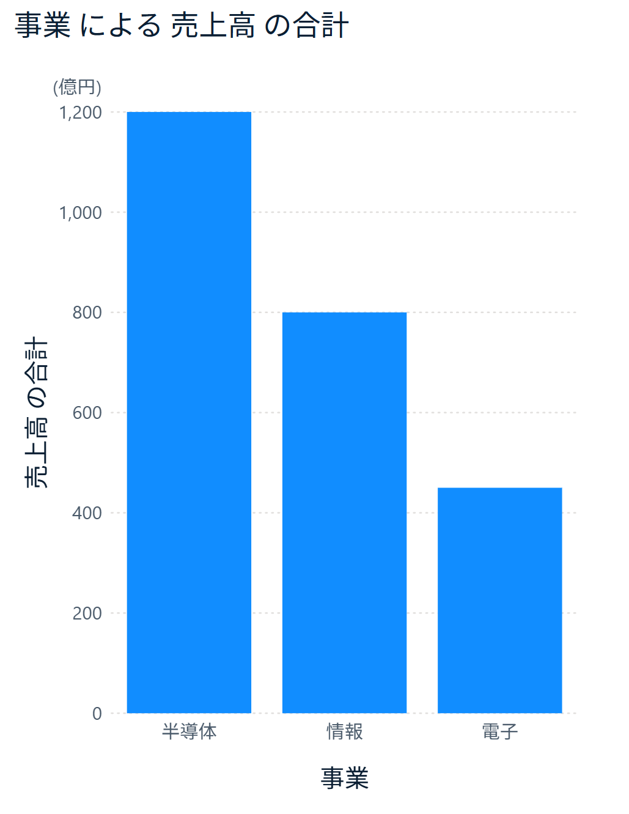

# 棒グラフ（Power BI カスタムビジュアル）

Power BI のカスタムビジュアルの棒グラフです。標準の棒グラフと同じように使えるようにしたうえで、標準では届かないグラフ表現を足していきます。いまは縦棒・横棒の集合・積み上げ・100% 積み上げに対応し、積み上げの棒はリボン（帯でつなぐ見せ方）にもでき、どれにも「折れ線の値」を重ねて描けます。

最初に足したのは単位の表示です。標準の棒グラフでは、表示単位を選ぶと目盛りが `120bn` のような英語の略記になり、「万」「億」も選べません。この棒グラフでは、目盛りを数字だけにして、軸の左上に `(億円)` のように単位をまとめて書けます。



## 標準の棒グラフとの違い

### 足したもの

- 表示単位を、なし・十・百・千・万・十万・百万・千万・億・十億・百億・千億・兆から選べます。「自動」では、データの大きさから千・万・百万・億・兆のどれかを選びます。
- 単位の文字（円・人・件など）を入力でき、表示単位と組み合わせて「億円」「万人」のように表示します。
- 単位を軸の左上に1回だけ書き、目盛りは数字だけにします。`(億円)`・`(単位: 億円)` の形、プロットエリアの右上への配置、非表示も選べます。
- 英語の表記（K・M・bn・T）にも切り替えられます。
- 第 2 Y 軸（折れ線の軸）にも同じ単位の設定があります。単位ラベルは第 2 Y 軸の上に出します。

### 標準に合わせたもの

- 書式設定の X 軸・Y 軸・グリッド線・データラベル・棒（標準の「列」）のおもな項目。棒の最大幅と角丸も設定できます。
- 凡例と複数の値（集合縦棒）。「凡例」にフィールドを入れるか、「値」に2つ以上入れると系列に分かれます。凡例の位置（12通り）・文字・タイトル（印は、棒なら棒と同じ見た目の四角、折れ線なら線とマーカー）、系列ごとの色・透過性・罫線、系列間のスペース、データラベルの系列ごとの表示と色を設定できます。
- 積み上げ縦棒と 100% 積み上げ縦棒、合計ラベル（正と負の分割）。積み上げのツールヒントには合計、100% 積み上げのツールヒントには割合を出します。
- 折れ線との複合（折れ線および集合縦棒・折れ線および積み上げ縦棒）。「折れ線の値」に入れたメジャーを折れ線で描き、棒と尺度が違えば右の第 2 Y 軸に出します。第 2 Y 軸（範囲・値・タイトル）、線（表示・色・幅・線のスタイル・結合の種類・補間の種類、ステップの段のつなぎと段の幅）、網掛け領域、マーカー（型・色・罫線）を設定できます。
- 横棒（集合横棒・積み上げ横棒・100% 積み上げ横棒）。書式設定のカードは標準と同じく、値の軸が「X 軸」、カテゴリの軸が「Y 軸」になります。
- リボン。積み上げと 100% 積み上げの棒を、隣のカテゴリの同じ系列と帯でつなぎます（「リボン」カードの見出しのトグル）。「積む順」を値の大きい順にすると、標準のリボン グラフと同じく、カテゴリごとに値の大きい系列を上に積み替えます。帯にマウスを乗せると、前後の値・変化・順位を出します。帯の色・透過性・罫線・リボンと棒の間のスペースを設定できます。標準のリボン グラフには「折れ線の値」の枠が無く、折れ線および積み上げ縦棒には「リボン」カードがありませんが、この棒グラフではリボンに「折れ線の値」も重ねて描けます。
- ツールヒント（凡例の値も出します）、他のビジュアルからの強調表示、クリックでの選択（凡例の項目のクリックで系列ごと選べます）。
- 「全般」カード（タイトル・効果・ヘッダーのアイコンなど）は、Power BI がどのビジュアルにも付けるものをそのまま使えます。

### 標準と動きが違うところ

- グラフの種類（集合・積み上げ・100% 積み上げ）と向き（縦棒・横棒）は、書式設定のいちばん上の「グラフの種類」カードで切り替えます（標準は視覚化ペインで別のビジュアルを選びます）。標準のリボン グラフは、積み上げにして「リボン」カードをオン、「積む順」を値の大きい順にすると同じ形になります。
- 標準の複合は縦棒だけですが、横棒でも「折れ線の値」を描けます。横棒のカテゴリは順番に意味の無いもの（部門・製品など）が多いので、既定では線でつながずマーカーだけを出します（実績の棒に目標の印を打つ使い方。線は「線」カードの「すべての系列に表示」で出せます）。尺度が違えば、値の軸の反対側（既定では上）に第 2 X 軸を出します。横棒のグリッド線は、値の線に「横」、カテゴリの区切りに「縦」の設定を使います。
- リボンの書式は系列ごとには変えられません（すべての帯に同じ設定）。横棒のリボンは、標準の積み上げ横棒と同じく、上下のカテゴリを帯でつなぎます。
- データラベルの値の表示単位は、Y 軸の表示単位に従います（ラベル側では選べません）。100% 積み上げで値を出すときは、値ごとに単位を付けます（1,250億 など）。
- データラベルの詳細の「カスタム」は、書式設定でフィールドを選ぶのではなく、フィールドの枠「ラベルの詳細」に入れた値を出します。「全体に対する割合」は、系列が複数か 100% 積み上げならカテゴリの合計に対する割合、系列が 1 本ならすべてのカテゴリの合計に対する割合です。合計ラベルは、表示単位が「自動」なら Y 軸に従い、選ぶとその単位で出して語を付けます。
- 並べ替えは、標準と同じくヘッダーの「…」からできるほか、書式設定の「棒」にある「値順で並べ替え」「順序を逆にする」でも行えます。「値順で並べ替え」は、系列が複数のときはカテゴリの合計の大きい順です。
- 凡例の項目が1行に入りきらないときは、次の行へ折り返します（標準は矢印で送ります）。
- 凡例を使うときの折れ線の値：標準はカテゴリごとに計算しますが、カスタムビジュアルは凡例で分けたデータしか受け取れません。そこで、凡例の値ごとの値が同じなら（凡例に左右されないメジャー）その値を、違えば足した値を使います。率や平均の線を凡例と一緒に使うときは、凡例に左右されないメジャーにしてください。
- 率のメジャー（書式に % がある）の第 2 Y 軸は、表示単位によらず目盛りを % で出します。
- マーカーの設定は、すべての線とカテゴリに共通です（標準はカテゴリごとにも変えられます）。網掛け領域の色も線ごとには変えられず、線の色に合わせるか 1 色を選びます。

### まだ無いもの

- 小さな複数
- 折れ線のデータラベル・系列ラベル
- 凡例の「表示順を反転」「スタイル」（印を丸・マーカー・線から選ぶ）、棒（標準の「列」）の「重複」、データラベルの系列ごとの設定のうち表示と色以外
- ドリルダウン（日付の階層などをたどる操作）
- 条件付き書式（fx）
- 分析ペインの線（定数線・平均線など）、ズームスライダー
- 書式設定の一部の項目（データラベルのタイトル・レイアウト・空白の表示方法など）

ほしい機能があれば Issues で教えてください。

## 対応環境

- Power BI Desktop 2.157（2026年9月）で動作を確認しています。
- Power BI サービスでは確認していません。

## 使い方

1. [Releases](https://github.com/itoken-lab-jp/bar-chart/releases) から `.pbiviz` ファイルをダウンロードします。
2. Power BI Desktop の「視覚化」ペインで「…」（その他のビジュアルの取得）を押し、「ビジュアルをファイルからインポート」を選びます。
3. 追加されたアイコンでビジュアルを置き、「カテゴリ」に分析の軸（事業、月など）、「値」にメジャー（売上高など）を入れます。系列に分けるときは、「凡例」にフィールド（区分、製品など）を入れるか、「値」に2つ以上入れます。
4. 書式設定の「Y 軸」カードで、「値」の表示単位と、「単位ラベル」の単位の追加文字を設定します。

## 新しい版に更新する

- 新しい版の `.pbiviz` を、使い方の 1・2 と同じ手順で取り込みます。レポートに前の版が入っていると、Power BI Desktop が更新するかを聞くので、「更新」を押します。変わるのはそのレポートだけです。
- 前の版で保存した書式の設定は、新しい版でもそのまま使えるようにしています。見た目が変わるところは [CHANGELOG](CHANGELOG.md) に書いています。
- 古い版の `.pbiviz` を取り込み直してレポートを保存すると、新しい版で足した書式の設定（1.22.0.0 の「段の幅」など）は、そのレポートから消えます。保存して閉じたあとは、新しい版に戻しても元に戻りません。古い版に戻すときは、先にレポートのコピーを取ってください。

## ソースからビルドする

Node.js 20 以上と npm が必要です。

```bash
npm ci
npm run typecheck
npm run package
```

`dist/` に `.pbiviz` ができます。

## ライセンス

MIT License（[LICENSE](LICENSE)）。同梱しているライブラリのライセンスは [THIRD_PARTY_NOTICES.md](THIRD_PARTY_NOTICES.md) にあります。

## 不具合の報告・要望

[Issues](https://github.com/itoken-lab-jp/bar-chart/issues) へお寄せください。個別の相談や開発の依頼はお受けしていません。
