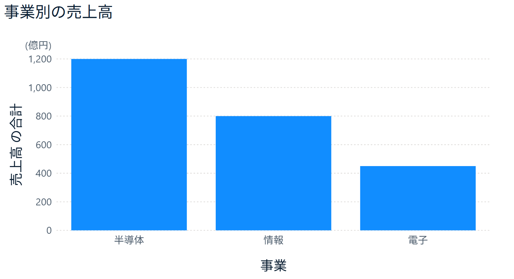
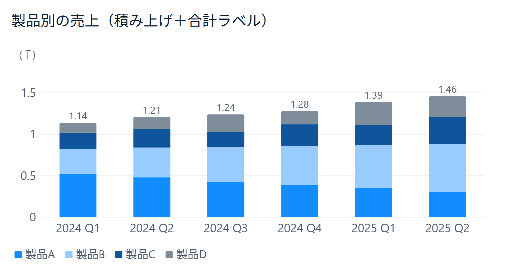
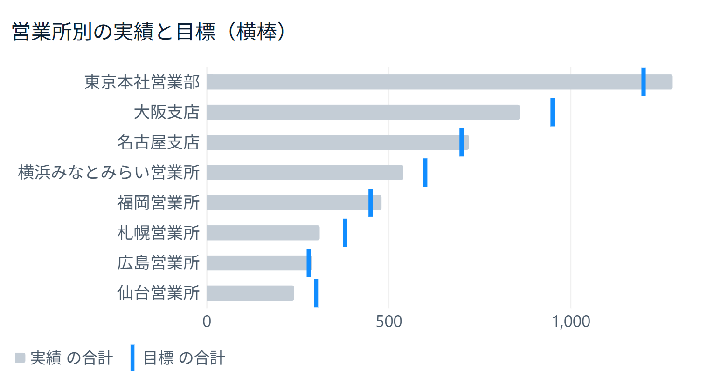
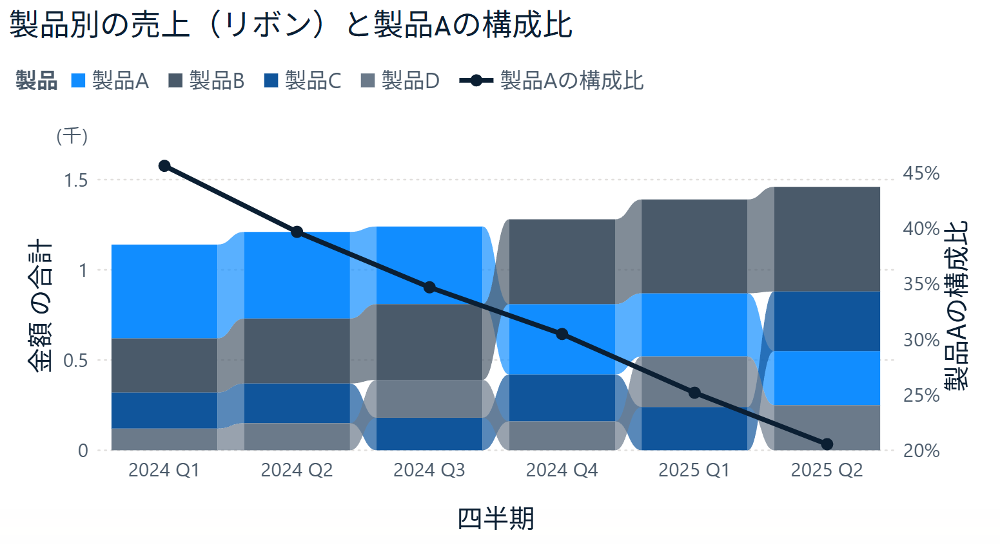
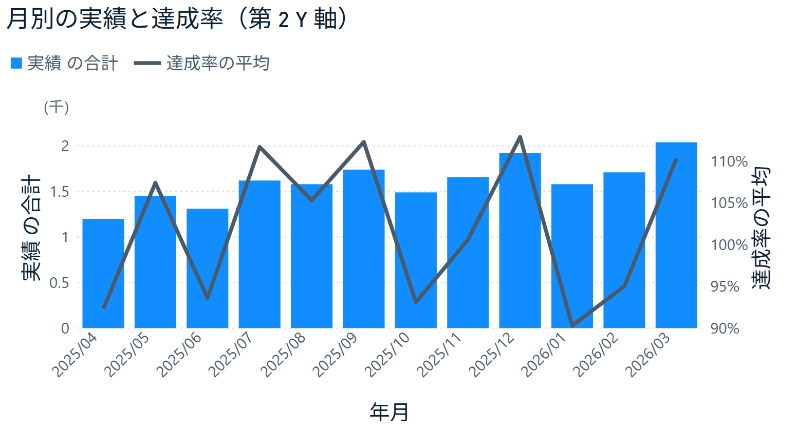
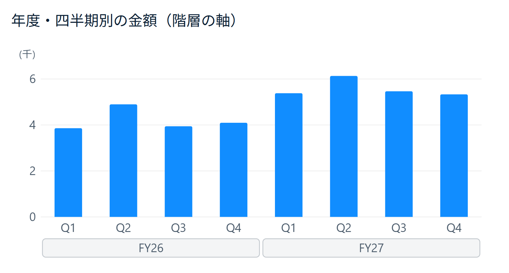
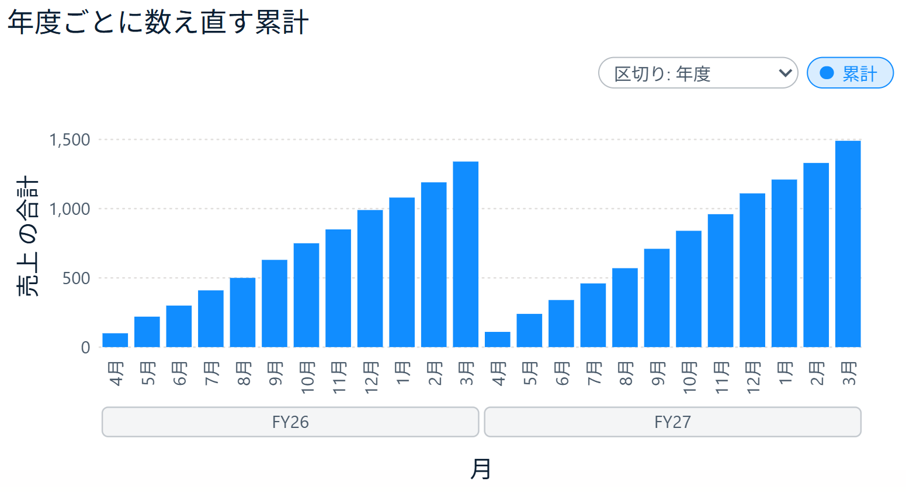
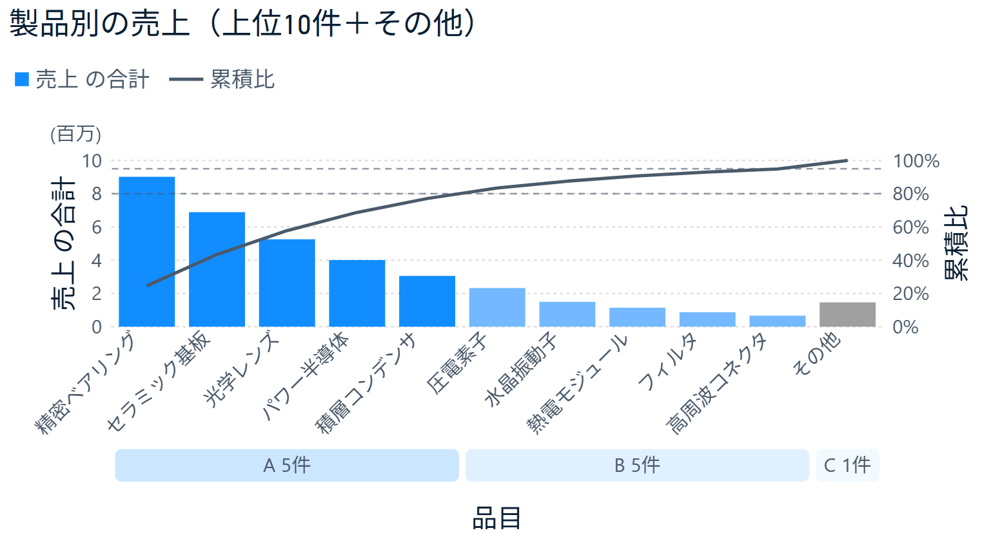

# 棒グラフ by itoken lab（Power BI カスタムビジュアル）

「棒グラフ by itoken lab」は、Power BI のカスタムビジュアルの棒グラフです。標準の棒グラフと同じように使えるようにしたうえで、標準では届かないグラフ表現を足していきます。下の図は、どれもこの 1 つのビジュアルで、書式設定を切り替えて描いています。

作っているのは、個人で Power BI のカスタムビジュアルを作っている itoken lab です。使い方は [note](https://note.com/itoken_lab) の記事でも紹介しています。

## できること

<table>
<tr>
<td width="50%" valign="top"><br><b>単位を軸の左上にまとめる</b><br>書式設定の「Y 軸」で「表示単位」を「億」、「単位の追加文字」を「円」にすると、目盛りは数字だけになり、単位は軸の左上に (億円) と 1 回だけ出ます。</td>
<td width="50%" valign="top"><br><b>集合・積み上げ・100% 積み上げ</b><br>凡例で系列に分けて積み上げ、棒の上に合計を出せます。縦棒・横棒のどちらでも使えます。</td>
</tr>
<tr>
<td width="50%" valign="top"><br><b>横棒に目標の印</b><br>視覚化ペインの「折れ線の値」の欄に目標のメジャーを入れると、横棒の上に目標を印で打てます。欄の名前は「折れ線の値」ですが、横棒では線でつながず印だけを出します。</td>
<td width="50%" valign="top"><br><b>リボン</b><br>積み上げの棒のあいだを帯でつなぎ、四半期ごとにどの製品が伸びたか・順位が入れ替わったかを見せます。折れ線も重ねられます。</td>
</tr>
<tr>
<td width="50%" valign="top"><br><b>折れ線と第 2 Y 軸</b><br>尺度の違う率は右の第 2 Y 軸に描きます。第 2 Y 軸にも単位の設定があります。</td>
<td width="50%" valign="top"><br><b>階層の軸</b><br>年度・四半期のように複数のレベルを展開し、下のレベルを上のレベルのまとまりで囲んで並べます。</td>
</tr>
<tr>
<td width="50%" valign="top"><br><b>累計</b><br>年度が変わったら数え直します。見る人がボタンで月ごとの値に戻せます。</td>
<td width="50%" valign="top"><br><b>パレート図と上位 N 件＋その他</b><br>大きい順の棒に、上から足した割合（累積比）の線を重ねます。よく売れるものから順に重点を決める ABC 分析の形で、初期設定では累積比 80% までを A、95% までを B、残りを C に分け、帯を押すとそのランクの製品をまとめて選べます。製品が多いときは、上位だけを棒にして残りを「その他」にまとめられます。</td>
</tr>
</table>

## 標準の棒グラフとの違い

### 足したもの

- 表示単位を、なし・十・百・千・万・十万・百万・千万・億・十億・百億・千億・兆から選べます。「自動」では、データの大きさから千・万・百万・億・兆のどれかを選びます。
- 「単位の追加文字」に円・人・件などを入れると、表示単位と組み合わせて「億円」「万人」のように表示します。
- 単位を軸の左上に1回だけ書き、目盛りは数字だけにします。書き方は `(億円)`・`(単位: 億円)` から選べます。書く場所は、既定の軸の左上のほか、グラフの枠の中の右上にもでき、出さないこともできます。
- 英語の表記（K・M・bn・T）にも切り替えられます。
- パレート図（「累計・パレート」カードの「計算」）。値の大きい順に並べ、累積比の線を右の軸（0〜100%）に重ね、累積比 80%・95% を境目に A・B・C に分けて棒を塗り分けます（境目は変えられます）。境目の破線と、X 軸の下のランクの帯（押すとそのランクをまとめて選ぶ）を出せます。値が 0 以下のカテゴリは累積比に数えないので、累積比は 100% で止まります。
- 上位 N 件＋「その他」（「棒」カードの「その他にまとめる」）。値の大きい順に上位の件数だけ棒を出し、残りを 1 本の「その他」にまとめます。「その他」の棒をクリックすると、まとめたカテゴリを全部選びます。パレートでは「その他」も累積比に入ります。
- 累計（「累計・パレート」カード）。棒の値を並んだ順に足していき、軸の階層のレベル（年度など）で 0 に戻せます。凡例があれば系列ごとに足し、折れ線も線ごとに累計に含められます。グラフの右上に閲覧者用の切り替えボタンと区切りの選択を出せます（押した状態はレポートに保存します。見る人の切り替えはブックマークには入らないので、ブックマークで月ごとと累計を切り替える作りにはできません）。標準の棒グラフでは、累計のための計算式（クイック メジャーやビジュアル計算）を自分で作り、並べ替えや区切りに合わせる必要があります。
- 第 2 Y 軸（折れ線の軸）にも同じ単位の設定があります。単位ラベルは第 2 Y 軸の上に出します。
- ドリルダウンしたとき、今いる位置（「FY26 ＞ H1」「事業A ＞ 製品A1」など）をグラフの左上に出します。「グラフの種類」カードの「ドリルの位置」で消せます。標準の棒グラフには無い表示で、同じことをするには、タイトルを式（DAX）で組み立てる必要があります。
- 目盛り（グリッド線）の本数の目安を、「Y 軸」カードの「範囲」で決められます（横棒では「X 軸」カード）。空なら標準と同じく、描く範囲の長さで本数を決めます。
- **画像としてコピー**：グラフにマウスを乗せると、右下に「画像としてコピー」のボタンが出ます。押すと、見えているグラフ（軸・凡例・単位を含む）を画像としてクリップボードに入れ、PowerPoint・Word・Excel に図として貼れます。ボタンをドラッグすると画像のファイルとして持ち出せるので、チャットなど画像しか受け取らない所にも渡せます。Power BI サービスでは、ボタンの右クリックでブラウザーの「画像をコピー」も使えます。スクロールしているときは、見えている範囲を写します。「グラフの種類」カードの「画像のコピー」で消せます。
- **スクロールの最初の位置**：カテゴリが多くてスクロールするとき、開いたときに先頭と末尾のどちらから見せるかを選べます（「X 軸」カードの「レイアウト」、横向きでは「Y 軸」カード）。月ごとの推移で最新を見せたいときは末尾にします。見る人がスクロールしたあとは、書式や大きさを変えても位置を戻しません。

### 標準に合わせたもの

- 書式設定の X 軸・Y 軸・グリッド線・データラベル・棒（標準の「列」）のおもな項目。棒の最大幅と角丸も設定できます。
- 凡例と複数の値（集合縦棒）。「凡例」にフィールドを入れるか、「値」に2つ以上入れると系列に分かれます。凡例の位置（12通り）・文字・タイトル（印は、棒なら棒と同じ見た目の四角、折れ線なら線とマーカー）、系列ごとの色・透過性・罫線、系列間のスペース、データラベルの系列ごとの表示と色を設定できます。
- 積み上げ縦棒と 100% 積み上げ縦棒、合計ラベル（正と負の分割）。積み上げのツールヒントには合計、100% 積み上げのツールヒントには割合を出します。
- 折れ線との複合（折れ線および集合縦棒・折れ線および積み上げ縦棒）。「折れ線の値」に入れたメジャーを折れ線で描き、棒と値の大きさが大きく違えば（売上と率など）、右の第 2 Y 軸に出します。第 2 Y 軸（範囲・値・タイトル）、線（表示・色・幅・線のスタイル・結合の種類・補間の種類、ステップの段のつなぎと段の幅）、網掛け領域、マーカー（型・色・罫線）を設定できます。
- 横棒（集合横棒・積み上げ横棒・100% 積み上げ横棒）。書式設定のカードは標準と同じく、値の軸が「X 軸」、カテゴリの軸が「Y 軸」になります。
- リボン。積み上げと 100% 積み上げの棒を、隣のカテゴリの同じ系列と帯でつなぎます（「リボン」カードの見出しのトグル）。「リボン」カードの「積む順」を値の大きい順にすると、標準のリボン グラフと同じく、カテゴリごとに値の大きい系列を上に積み替えます。帯にマウスを乗せると、前後の値・変化・順位を出します。帯の色・透過性・罫線・リボンと棒の間のスペースを設定できます。標準のリボン グラフには「折れ線の値」の枠が無く、折れ線および積み上げ縦棒には「リボン」カードがありませんが、この棒グラフではリボンに「折れ線の値」も重ねて描けます。
- 軸の階層（ドリルダウン）。「カテゴリ」にフィールドを複数入れると、ヘッダーの矢印でドリルアップ・ドリルダウン・すべて展開ができます。展開したときは、下のレベル（四半期など）の軸ラベルの下に、上のレベル（年度など）の名前をもう 1 行並べて点線で区切るか、X 軸の「ラベルの連結」で「FY26 Q1」のように 1 行につなぎます。X 軸の「階層の見せ方」を「囲み」にすると、点線の代わりに、上のレベルのまとまりごとに角の丸い枠で囲みます（標準に無い見せ方）。上のレベルの区切りを押すと、その区切りのカテゴリをまとめて選べます（Ctrl を押しながらで足す）。ドリルダウンした先では、どのカテゴリでも同じ上のレベル（ドリルしてきた年度など）は軸に繰り返さず、左上の位置の表示に出します。
- ツールヒント（凡例の値も出します）、他のビジュアルからの強調表示、クリックでの選択（凡例の項目のクリックで系列ごと選べます）。
- 「全般」カード（タイトル・効果・ヘッダーのアイコンなど）は、Power BI がどのビジュアルにも付けるものをそのまま使えます。
- レポートのテーマに従います。テーマ（既定の Fluent 2 など）が決めている軸のタイトルの表示、凡例の位置、グリッド線、X 軸の「高さの最大値」、系列が 1 本のときの棒の色を、書式設定で変えていない所の既定にします。書式設定で変えた所は、そちらを使います。

### 標準と動きが違うところ

標準の棒グラフから置き換えるときに気をつける所です。はじめて使うだけなら、読み飛ばしてかまいません。

- グラフの種類（集合・積み上げ・100% 積み上げ）と向き（縦棒・横棒）は、書式設定のいちばん上の「グラフの種類」カードで切り替えます（標準は視覚化ペインで別のビジュアルを選びます）。標準のリボン グラフは、積み上げにして「リボン」カードをオン、「積む順」を値の大きい順にすると同じ形になります。
- 標準の複合は縦棒だけですが、横棒でも「折れ線の値」を描けます。横棒のカテゴリは順番に意味の無いもの（部門・製品など）が多いので、既定では線でつながずマーカーだけを出します（実績の棒に目標の印を打つ使い方。線は「線」カードの「すべての系列に表示」で出せます）。尺度が違えば、値の軸の反対側（既定では上）に第 2 X 軸を出します。横棒のグリッド線は、値の線に「横」、カテゴリの区切りに「縦」の設定を使います。
- リボンの書式は系列ごとには変えられません（すべての帯に同じ設定）。横棒のリボンは、標準の積み上げ横棒と同じく、上下のカテゴリを帯でつなぎます。
- データラベルの値の表示単位は、Y 軸の表示単位に従います（ラベル側では選べません）。100% 積み上げで値を出すときは、値ごとに単位を付けます（1,250億 など）。
- データラベルの詳細の「カスタム」は、書式設定でフィールドを選ぶのではなく、視覚化ペインの「ラベルの詳細」の欄に入れた値を出します。「全体に対する割合」は、系列が複数か 100% 積み上げならカテゴリの合計に対する割合、系列が 1 本ならすべてのカテゴリの合計に対する割合です。合計ラベルは、表示単位が「自動」なら Y 軸に従い、選ぶとその単位で出して語を付けます。
- 並べ替えは、標準と同じくヘッダーの「…」からできるほか、書式設定の「棒」にある「値順で並べ替え」「順序を逆にする」でも行えます。「値順で並べ替え」は、系列が複数のときはカテゴリの合計の大きい順です。軸の階層を展開しているときは、親の中で並べ替えます。
- 凡例の項目が1行に入りきらないときは、次の行へ折り返します（標準は矢印で送ります）。
- 凡例を使うときの折れ線の値：標準はカテゴリごとに計算しますが、カスタムビジュアルは凡例で分けたデータしか受け取れません。そこで、凡例の値ごとの値が同じなら（凡例に左右されないメジャー）その値を、違えば足した値を使います。率や平均の線を凡例と一緒に使うときは、凡例で分けても値が変わらないメジャー（DAX の `ALL` 関数で凡例の列を外したものなど）にしてください。
- 率のメジャー（書式に % がある）の第 2 Y 軸は、表示単位によらず目盛りを % で出します。
- マーカーの設定は、すべての線とカテゴリに共通です（標準はカテゴリごとにも変えられます）。網掛け領域の色も線ごとには変えられず、線の色に合わせるか 1 色を選びます。
- Power BI サービスの「キャプション付きの画像としてコピー」は、Microsoft の説明では、認定されていないカスタム ビジュアルには対応が限られています。グラフを画像にするときは、右下の「画像としてコピー」のボタンを使ってください。このボタンは、管理者がテナントの設定（ビジュアルのコピーと貼り付け）でコピーを止めていても使えます（ビジュアルからはその設定が分かりません）。止めたいレポートでは、書式の「画像のコピー」をオフにしてください。標準のコピーが添えるキャプション（レポートの名前とリンク、データの日時、フィルター、機密ラベル）は付きません。

### まだ無いもの

- 小さな複数（同じグラフを項目ごとに小さく並べる機能）
- 折れ線のデータラベル・系列ラベル
- 凡例の「表示順を反転」「スタイル」（印を丸・マーカー・線から選ぶ）、棒（標準の「列」）の「重複」（系列の棒を重ねる設定）、データラベルの系列ごとの設定のうち表示と色以外
- 条件付き書式（fx）
- 分析ペインの線（定数線・平均線など）、ズームスライダー
- 書式設定の一部の項目（データラベルのタイトル・レイアウト・空白の表示方法など）

ほしい機能があれば [Issues](https://github.com/itoken-lab-jp/bar-chart/issues) で教えてください。

## 対応環境

- Power BI Desktop のバージョン 2.157（2026年9月版）で動作を確認しています。バージョンは Desktop の「ヘルプ」→「バージョン情報」で確かめられます。
- Power BI サービスでは確認していません。

## 使い方

1. [Releases](https://github.com/itoken-lab-jp/bar-chart/releases) から `.pbiviz` ファイルをダウンロードします。
2. Power BI Desktop の「視覚化」ペインで「…」（その他のビジュアルの取得）を押し、「ビジュアルをファイルからインポート」を選びます。
3. 追加されたアイコンでビジュアルを置き、「カテゴリ」に分析の軸（事業、月など）、「値」にメジャー（売上高など）を入れます。系列に分けるときは、「凡例」にフィールド（区分、製品など）を入れるか、「値」に2つ以上入れます。
4. 目標や率を線・印で重ねるときは、「折れ線の値」にメジャー（目標、達成率など）を入れます。
5. 書式設定の「Y 軸」カードで、「値」の中の「表示単位」と、「単位ラベル」の中の「単位の追加文字」を設定します。グラフの種類は書式設定の「グラフの種類」カード、累計とパレート図は「累計・パレート」カードで切り替えます。

## 新しい版に更新する

- 新しい版の `.pbiviz` を、使い方の 1・2 と同じ手順で取り込みます。レポートに前の版が入っていると、Power BI Desktop が更新するかを聞くので、「更新」を押します。変わるのはそのレポートだけで、ほかのレポートに入っている前の版はそのまま残ります（レポートごとに取り込み直します）。
- 前の版で保存した書式の設定は、新しい版でもそのまま使えるようにしています。見た目が変わるところは [CHANGELOG](CHANGELOG.md) に書いています。
- 古い版の `.pbiviz` を取り込み直してレポートを保存すると、新しい版で足した書式の設定は、そのレポートから消えます。保存して閉じたあとは、新しい版に戻しても元に戻りません。古い版に戻すときは、先にレポートのコピーを取ってください。

## ソースからビルドする

自分でコードを直して `.pbiviz` を作りたい人向けです。使うだけなら、この節は要りません。Node.js 20 以上と npm が必要です。

```bash
npm ci
npm run typecheck
npm run package
```

`dist/` に `.pbiviz` ができます。

## ライセンス

MIT License（[LICENSE](LICENSE)）です。仕事での利用も含め、無料で使えます。同梱しているライブラリのライセンスは [THIRD_PARTY_NOTICES.md](THIRD_PARTY_NOTICES.md) にあります。

## 不具合の報告・要望

[Issues](https://github.com/itoken-lab-jp/bar-chart/issues) へお寄せください。個別の相談や開発の依頼はお受けしていません。
